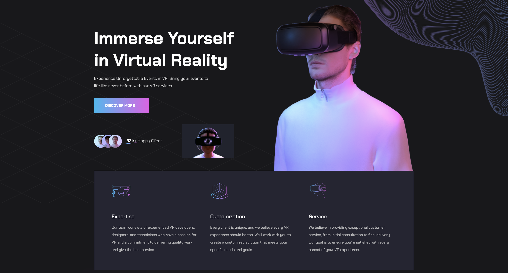
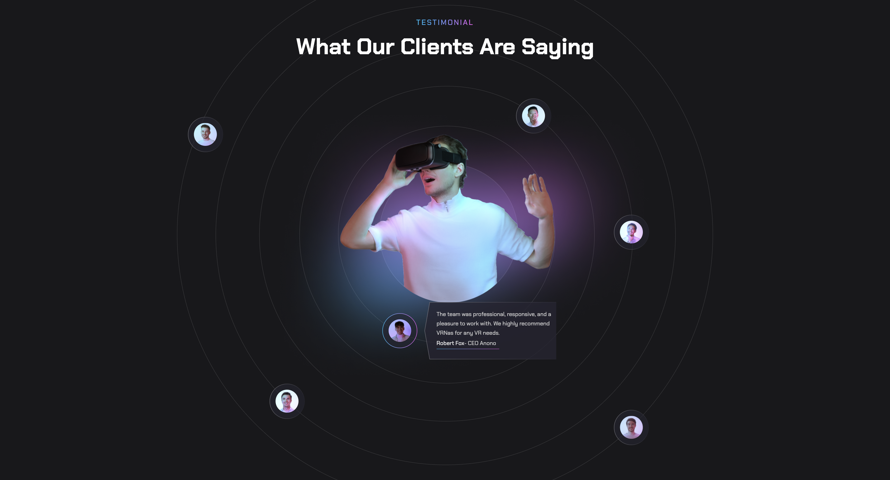

# Virtual reality

## Contents
1. [Main Information](#📜-Main-Information)
2. [Stack](#Stack)
3. [Installation and Usage](#Installation-and-Usage)
4. [Examples](#Examples)

____

## 📜 Main Information

This project was created for practising complex 
adaptive layout using React library. The goal of 
the project is to improve skills in layout design, 
responsive design, and working with React components.

Please note that this project includes only one page 
and is not a complete application.
____

## Stack

✅ HTML (JSX), CSS, SCSS, ANT DESIGN

✅ JavaScript ES6+

✅ React

✅ React Router

✅ ESLint

✅ Webpack

____

## Installation and Usage

**Installation:**

* Clone the repository: git clone https://github.com/reyand8/Virtual-reality.git

**Usage:**

* Application
    - Navigate to the directory: cd virtual-reality
    - Install dependencies: npm install
    - Run the application: npm run start
    - Open a browser and navigate to: http://localhost:3000
____
____

## Examples

____
____

____
____

____
____

____
____

____
____

____
____

____
____

____
____

____
____

____
____

